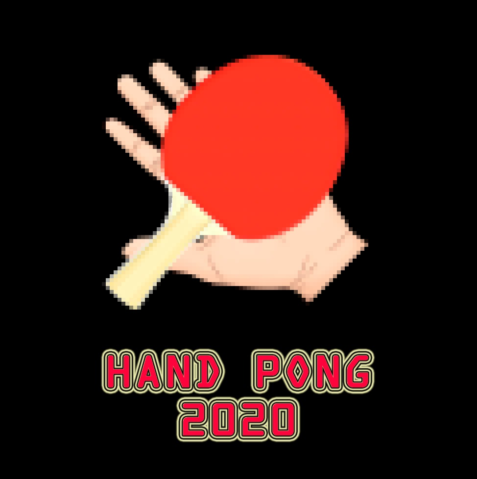

# handpong

### ¿Qué es HandPong?

Es nuestra visión moderna del reconocido juego "pong". No hacen falta mandos para jugar, solo basta con mover las manos!

Dos modos de juego: 
  - un jugador, estilo frontón
  - dos jugadores, uno contra uno

### Tecnologías utilizadas

Unity: es el motor de la interfaz gráfica del juego.

Matlab: es la herramienta con la cual se desarrolló la interfaz de control a través de técnicas de IA.

### ¿Cómo funciona?

Implementamos una red neuronal YOLOv2 que usa las características extraídas por una MobileNetv2 pre-entrenada en el dataset ImageNet. Esta red MobilenetV2+YOLOv2 es lo que proporciona la capacidad de detectar manos en tiempo real!

Entrenamos la red para nuestra aplicación utilizando dos datasets de terceros (ver referencias al final), Hand Dataset y EgoHands Dataset
y creamos uno nuevo donde etiquetamos unas ~1200 fotos para entrenar la red neuronal con escenarios mas similares a los del videojuego.

Creamos en Unity una interfaz basada en el antiguo Pong, y le dimos nuestro propio toque moderno.

Conectamos el videojuego de Unity con Matlab a traves de comunicación TCP. Matlab detecta continuamente las imagenes captadas por la webcam y a través de un puerto pasa la información al motor Unity para que mueva las palas.

## HandPong realizado por

JORGE CRISTÓBAL ASCASO, 
MAXIMILIANO NICOLÁS PALAY SILVA, 
FELIPE ANGEL PASCUAL TORTOLA, 
PAULA TOMÁS COLLADO 
en el marco de la asignatura Sistemas Complejos Bioinspirados de la Univesidad Politecnica de Valencia,  
dictada por Andreu M. Climent, PhD.

2020
 
## Referencias/Créditos

Este proyecto fue hecho en el marco de la asignatura Sistemas Complejos Bioinspirados en la Universidad Politécnica de Valencia, dictada por Andreu M. Climent, PhD.

#### Hand Dataset
A. Mittal, A. Zisserman, P. H. S. Torr  
Hand detection using multiple proposals   
British Machine Vision Conference, 2011  
Disponible en http://www.robots.ox.ac.uk/~vgg/data/hands/

#### EgoHands Dataset
Bambach, Sven and Lee, Stefan and Crandall, David J. and Yu, Chen  
Lending A Hand: Detecting Hands and Recognizing Activities in Complex Egocentric Interactions  
The IEEE International Conference on Computer Vision (ICCV)  
December 2015  
Disponible en http://vision.soic.indiana.edu/projects/egohands/

#### Dataset de elaboración propia
Disponible en 

Otras referencias, como documentación de Matlab utilizada pueden encontrarse en los archivos de código como comentarios.
